# Lan-Sync

This project aim to create a replica of Drive/DropBox LAN to fully use a small server to handle large files and backup using fully my home network at high speed.

# Design

The server backend is written in C++ with the help of a SQLite DB. The aim of the server is to:
- Handle multiple connections to store/download files
- Manage the SSD cache and main HDD storage space
- Handle file corruptions thro SHA-256 singe
- Handle a small monitoring backend

The cliend is quite simle, a standard python API to store, download and look-up files directly to the server

# Desing
(this graph is not conclusive, i was just tring mermaid lol)

```mermaid
    architecture-beta
    group server(cloud)[Server] 
    group storage(stor)[Storage] in server
    group client(internet)[Client]

    service api(Api)[Pyton API] in client

    service proces(server)[Backend] in server
    service db(database)[DB] in server
    service ssd(disk)[SSD Write Cache]in server

    service hdd(disk)[Main HDDs storage] in storage

    api:L <--> R:proces
    proces:L --> R:ssd
    proces:B <--> T:hdd
    ssd:B --> T:hdd
    hdd:R -- L:db
    proces:B -- T:db
    
```
